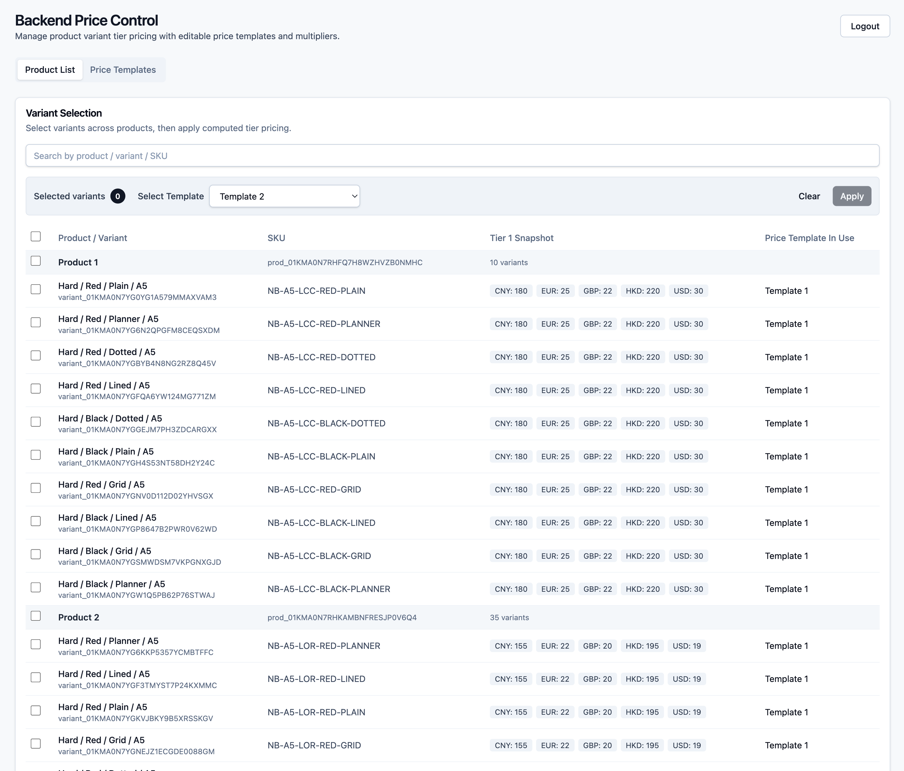
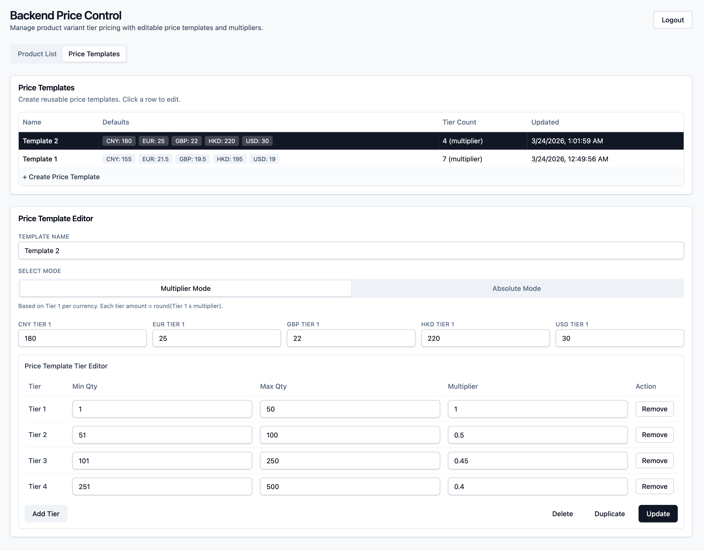

# Backend Price Control

Medusa admin-authenticated pricing console for bulk variant tier pricing.

This app lives at `apps/medusajs-tier-price-bulk-control` and uses:
- TanStack Start + React + Tailwind
- shadcn-style UI primitives
- Medusa Admin auth (`user/emailpass`)
- Custom Medusa admin APIs under `/admin/price-control/*`

## What It Does

- Browse product variants with checkbox bulk selection.
- Apply tier pricing to selected variants using `replace_all_tiers` mode.
- Manage reusable **Price Templates** (multiplier mode or absolute mode).
- Duplicate/update/delete templates.
- Show template-in-use hint in the variant list.
- Open variant price detail modal (row click).

## Screenshots





## AI Prompt Templates

Use these prompts with your coding AI assistant.

### Prompt: Integrate Into Another Medusa Repo

```text
Integrate the Backend Price Control feature into this Medusa v2 monorepo.

Requirements:
1) Add frontend app at apps/medusajs-tier-price-bulk-control.
2) Add backend admin APIs under src/api/admin/price-control/*.
3) Add module src/modules/price-control-template/* and register it in medusa-config.ts.
4) Register adminPriceControlMiddlewares in src/api/middlewares.ts.
5) Run/prepare DB migration for price_control_template.
6) Ensure CORS includes the frontend dev origin in STORE_CORS, ADMIN_CORS, AUTH_CORS.
7) Verify login with sdk.auth.login("user","emailpass", ...).
8) Verify routes:
   - GET /admin/price-control/currencies
   - GET /admin/price-control/variants
   - GET/POST /admin/price-control/templates
   - POST/DELETE /admin/price-control/templates/:id
   - POST /admin/price-control/apply
9) Return:
   - changed files list
   - run commands
   - any manual follow-up steps.
```

### Prompt: Operate the Tool (Daily Use)

```text
You are my assistant for Backend Price Control operations.
When I provide a goal, return exact click-by-click steps using this flow:
1) Product List: select variants.
2) Select Template (optional).
3) Apply.
4) Price Templates: create/edit/duplicate/delete template if needed.

Rules:
- Keep instructions short and numbered.
- If I provide target prices, derive multiplier guidance from Tier 1.
- Warn me before destructive actions (delete/replace-all apply).
```


## Compatibility

- Medusa backend: `@medusajs/* 2.13.4` (same as this workspace)
- Node: `>= 20`

## Quick Start (This Monorepo)

### 1) Backend setup

From repo root:

```bash
pnpm --filter backend dev
```

In another terminal, run migrations (first time / after pulling changes):

```bash
pnpm --filter backend exec medusa db:migrate
```

Optional sample seed:

```bash
pnpm --filter backend seed
```

### 2) Frontend setup

Create env file for app:

```bash
cp apps/medusajs-tier-price-bulk-control/.env.example apps/medusajs-tier-price-bulk-control/.env
```

Default values:

```env
VITE_MEDUSA_BACKEND_URL=http://localhost:9000
VITE_PORT=5177
```

Start the app:

```bash
pnpm --filter medusajs-tier-price-bulk-control dev
```

Open: `http://localhost:5177`

### 3) Login

Use a Medusa **admin user** account (not customer login).

Auth flow uses:

```ts
sdk.auth.login("user", "emailpass", { email, password })
```

## Required Backend Extension (Important)

This frontend is **not standalone**. It requires custom backend code in `apps/backend`:

- API routes: `src/api/admin/price-control/*`
- API middleware/validation: `src/api/admin/price-control/middlewares.ts`
- Template module: `src/modules/price-control-template/*`
- Module registration in `medusa-config.ts`
- Template migration:
  - `src/modules/price-control-template/migrations/Migration20260323093000.ts`

If these are missing, the app will fail on `/admin/price-control/*` requests.

## API Surface

All routes require admin auth (`authenticate("user", ["bearer", "session"])`).

- `GET /admin/price-control/currencies`
- `GET /admin/price-control/variants?limit&offset&q&product_id`
- `GET /admin/price-control/templates`
- `POST /admin/price-control/templates`
- `POST /admin/price-control/templates/:id`
- `DELETE /admin/price-control/templates/:id`
- `POST /admin/price-control/apply`

Apply mode supported:
- `mode: "replace_all_tiers"`

## CORS / Dev Origin

Backend env must allow this frontend origin in:
- `STORE_CORS`
- `ADMIN_CORS`
- `AUTH_CORS`

For local default app port, include `http://localhost:5177`.

## Tests and Build

From repo root:

```bash
pnpm --filter medusajs-tier-price-bulk-control lint
pnpm --filter medusajs-tier-price-bulk-control test
pnpm --filter medusajs-tier-price-bulk-control build

pnpm --filter backend test:unit
pnpm --filter backend build
```

## Can This Be Reused In Any Medusa Project?

Yes, with backend extension copy-in.

You can reuse this in another Medusa v2 project if you bring both parts:

1. Frontend app: `apps/medusajs-tier-price-bulk-control`
2. Backend extensions:
   - `src/api/admin/price-control/*`
   - `src/modules/price-control-template/*`
   - module registration + migration

Then:
- run backend migration,
- configure CORS/env,
- ensure admin user login works.

Without those backend extensions, this app will not work.

## IMPORTANT: PORT + MIGRATION REQUIRED

### YOU MUST PORT THE BACKEND EXTENSIONS AND RUN MIGRATION.

### FRONTEND-ONLY COPY WILL NOT WORK.

Before using this in another Medusa project, you must:

1. Copy backend APIs: `src/api/admin/price-control/*`
2. Copy backend module: `src/modules/price-control-template/*`
3. Register module in `medusa-config.ts`
4. Register `adminPriceControlMiddlewares` in `src/api/middlewares.ts`
5. Run migration:
   - `pnpm --filter backend exec medusa db:migrate`

## Port to Another Medusa Project (Step-by-Step)

Use this when moving the feature to a different Medusa v2 repo.

1. Copy frontend app folder:
   - `apps/medusajs-tier-price-bulk-control`
2. Copy backend API routes:
   - `apps/backend/src/api/admin/price-control/*`
3. Copy backend module:
   - `apps/backend/src/modules/price-control-template/*`
4. Register backend module in `medusa-config.ts`:
   - add `{ resolve: "./src/modules/price-control-template" }` in `modules`.
5. Register API middlewares:
   - import `adminPriceControlMiddlewares` in `src/api/middlewares.ts`
   - spread it in `defineMiddlewares({ routes: [...] })`.
6. Run migration:
   - `pnpm --filter backend exec medusa db:migrate`
7. Configure CORS in backend env:
   - include frontend origin in `STORE_CORS`, `ADMIN_CORS`, `AUTH_CORS`.
8. Configure frontend env:
   - `VITE_MEDUSA_BACKEND_URL=http://<your-backend-host>`
   - `VITE_PORT=<your-port>`
9. Start backend and frontend, then login with a Medusa admin user.

### Bundled Migration Copy (In This App)

For convenience, a migration copy is included here:

- `apps/medusajs-tier-price-bulk-control/medusa-backend-kit/src/modules/price-control-template/migrations/Migration20260323093000.ts`

Copy it into your backend (target Medusa project):

```bash
mkdir -p apps/backend/src/modules/price-control-template/migrations
cp apps/medusajs-tier-price-bulk-control/medusa-backend-kit/src/modules/price-control-template/migrations/Migration20260323093000.ts \
  apps/backend/src/modules/price-control-template/migrations/
pnpm --filter backend exec medusa db:migrate
```


## Open Source Notes

Recommended before publishing:
- Add project license at repo root (for example MIT).
- Remove any private keys/secrets from tracked files.
- Keep `.env` out of git and publish only `.env.example`.
- Document supported Medusa version(s).

## Folder Reference

- Frontend app:
  - `apps/medusajs-tier-price-bulk-control`
- Backend price-control APIs:
  - `apps/backend/src/api/admin/price-control`
- Backend template module:
  - `apps/backend/src/modules/price-control-template`
